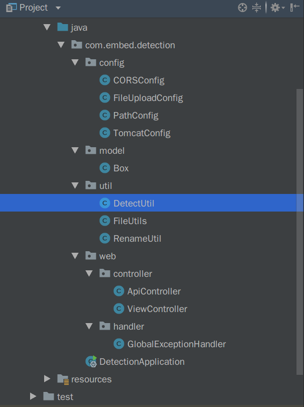
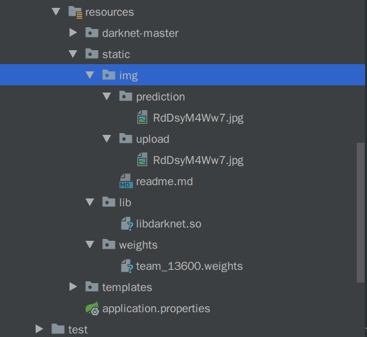
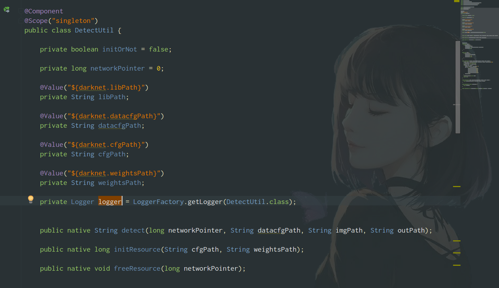
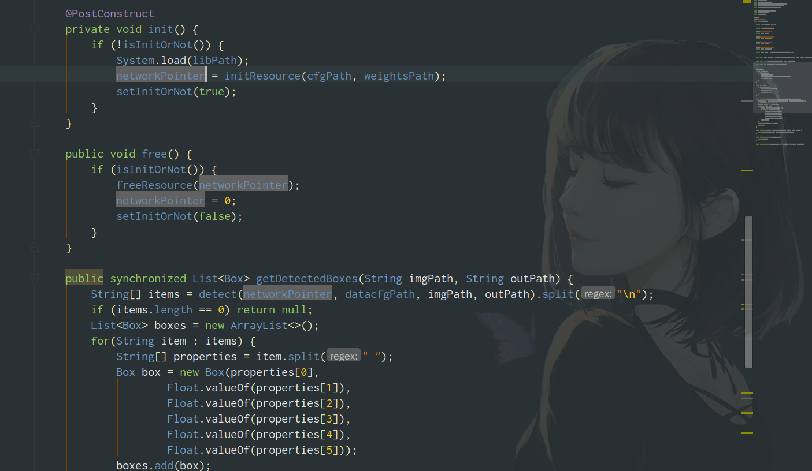
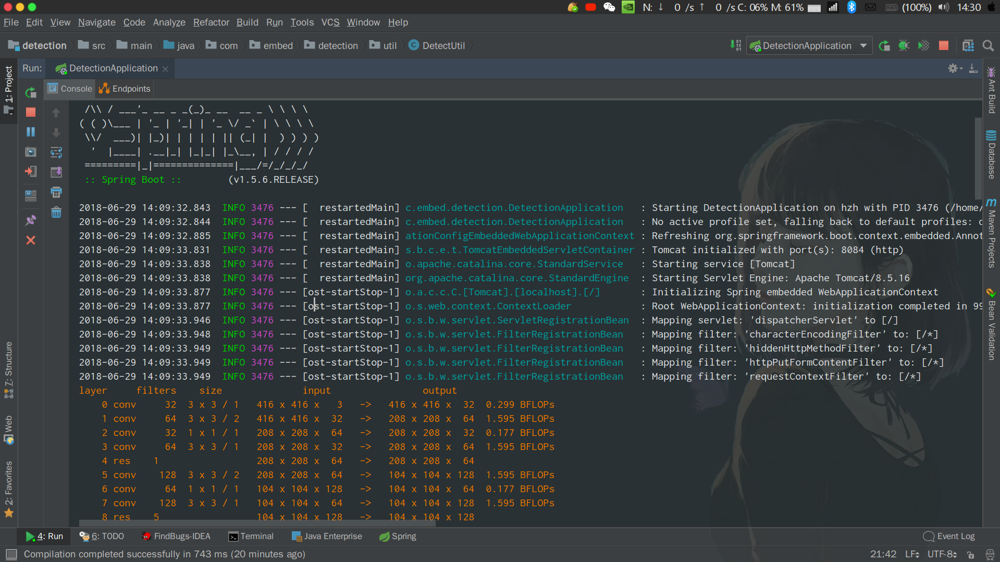
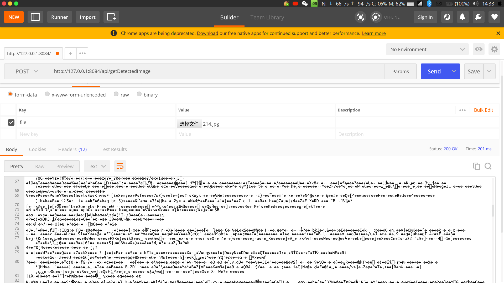
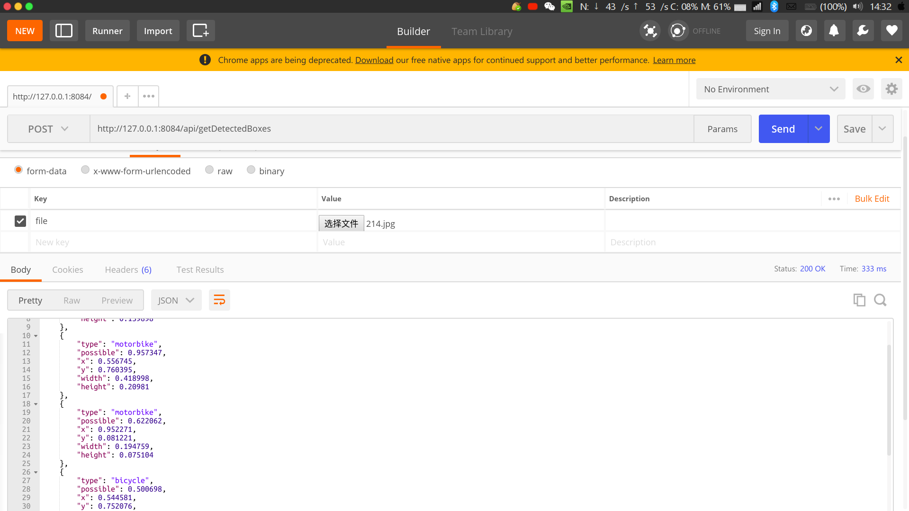
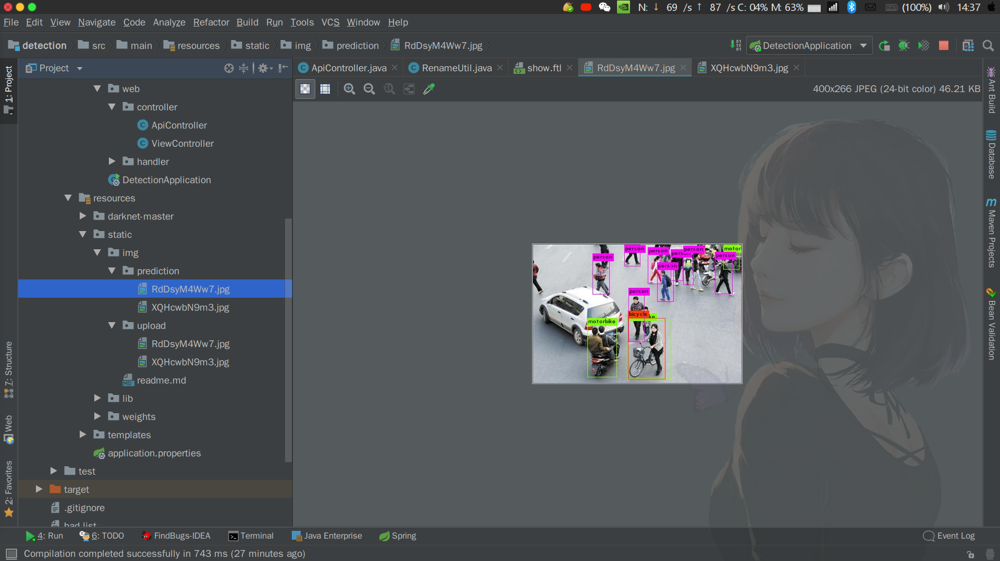
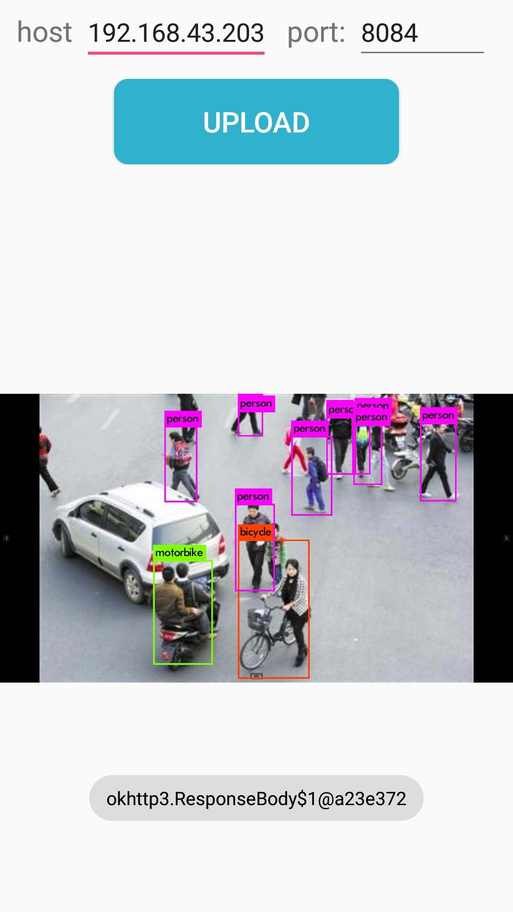

# 项目文档 (行人非机动车检测)

## 1. 前期工作(模型的训练)

### 项目目标

- 利用深度学习中的对象检测网络实现对道路上的行人或非机动车进行识别检测。
- 定位：一个基于图像/视频数据的目标检测问题，主要任务为对于以人为主体的监控环境来说，如何识别人、将人与其他对象进行有效的区分。从机器学习的角度着手，确定合适的特征描述，借助大量的训练样本，学习得到一个用于行人检测的分类器模型。
- 实现复杂背景下的高可靠性移动人体目标检测，针对复杂的背景环境以及多变的类内差异，抓住问题的本质，提升检测系统的鲁棒性。
- 对行人的手势或姿态进行识别（比如交警的指挥手势等），做出判断。 
### 项目目标分析：

基于深度学习方法的行人/非机动车检测问题主要工作涉及：

- 用于分类器训练及评价的大规模正、负样本集的收集

- 样本的特征描述

- 分类器模型的选择

- 分类器模型的训练

借助合适的特征描述子对样本图片进行特征提取，在此基础上，训练分类器；在检测时对目标图像进行特征提取后，利用已经训练好的分类器对目标图像进行检测

### 项目难点之特征描述及特征提取：

1. 不同行人/非机动车之间外观的差异
2. 人体姿态的多变
3. 遮挡现象
4. 背景杂乱

### 项目难点分析：

以上只是从特征描述的角度对行人/非机动车检测所面临的的挑战进行了简单分析，而从检测性能上看，如何有效平衡目标检测误判率和检测率，也是对行人检测系统性能进行有效取舍的一个重要因素。

对于基于视频的行人/非机动车检测来说，如何将行人/非机动车的运动信息与行人检测进行有效结合也是实现视频中实时行人检测的一个主要诉求。

### 训练实施过程

1. 样本数据的获取

   > 考虑正样本的选取对于最终分类器的检测性能至关重要，正样本采集应尽可能涵盖多种内容及场景，如：应尽量涵盖不同光照条件、多种复杂背景下的行人；考虑类内差异，样本应该涵盖不同表现、不同运动姿态的行人/非机动车，尽量降低甚至避免漏检的可能性。且由于本实验检测对象处于相对开放的环境下，因此对于负样本的采集应尽可能涵盖行人/非机动车可能出现的多种背景因素，理想情况下应包含除行人/非机动车之外的所有内容。故负样本需准备尽可能多的非行人/机动车图片。采用的数据集：
   >
   > 1. MSCOCO中2017的数据集
   > 2. INRIA数据库的行人数据集
   > 3. VOC数据集

2. 数据标注及训练

   > 数据标注：
   >
   > * 使用LabelImg开源工具对数据集进行标注，将行人和非机动车框出并生成对应于图片的坐标 , 记录在txt中。
   >
   > 数据训练：
   >
   > 1. 创建.cfg	.data文件 .cfg文件保存的是训练的配置信息,我们拷贝darknet自带的yolo-v3.cfg,再对其参数进行调整修改.data文件保存的是训练的数据集的路径,以及检测对象命名文件的路径
   >
   > 2. 在darknet文件夹下使用命令行输入：
   >
   >    ./darknet<.data文件的路径><.cfg文件的路径><备份的路径><预训练模型的路径>
   > 3. 开始训练

   ​

   ​

## 2. 项目设计及工程化应用 

### 预计的功能 : 

* 提供一个web rest 接口, 通过向这个接口 POST 一张图片, 获取检测后画框处理的图片
* 提供一个web rest 接口, 通过向这个接口 POST 一张图片, 获取检测到的框的类别, 置信度, 位置, 大小信息 (JSON 格式)
* 在后台实现输入一个视频, 输出检测后画框处理过的视频

### 难点 : 

* web app 我们采用Springboot 框架, java 语言编写, 而我们采用的 darknet 深度学习框架的编写语言为C语言需要跨语言调用
*  ​

### 设计思路 : 

* 方案一 : 

  > 用 C语言 编写一个 Socket Server, 通过套接字实现两个进程之间的通信 : Springboot Server 向 Socket Server 发送检测的命令, Socket Server 向 Springboot Server 发送检测的结果
  >
  > * 优点 : 不需要考虑语言相关性
  > * 缺点 : 一些业务逻辑无可避免的要耦合在C语言的Socket Server中, 项目的可扩展性很差
  > * 总结 : 在工程中不会使用这种方法 

* 方案二 :

* >在Springboot Server 中直接调用系统命令
  >
  >* 优点 : 非常简单
  >* 缺点 : 由于darknet 提供的detector test 指令, 再给定了需要检测的图片路径后, 一次只能检测一张图片, 每次的检测过程都需要初始化网络, 加载模型,非常耗时, 无法做到一次加载多次检测
  >* 总结 : 工程中不会采用这种方法

* 方案三 : 

* >用C语言编写我们的函数, 对darknet的源码进行扩展, 并打包成一个动态库文件, java程序通过JNI调用这个动态库中函数, 并对其进行封装,来实现功能的整合
  >
  >* 优点 : 可扩展性强, 降低了代码的耦合度, 复杂的业务逻辑只需要在java 的Springboot server 后台编写
  >* 缺点 : 实现的难度较大
  >* 总结 : 在工程中会采用此方法

#### 我们最终采用了方案三

## 项目实现

### 项目结构 : 

* java目录存放我们的后台项目源码
* resource 目录存放我们的一些项目资源
  * darknet-master存放我们扩展, 修改后的darknet框架
  * static/img/upload 存放上传的需要检测的图片
  * static/img/prediction 存放预测后画框处理过的图片
  * lib 存放 我们项目用到的动态库
  * weights 存放我们项目使用的模型
  * template 存放 freemarker模板

### 源码简介

1.  DetectUtil 对物体检测功能进行了一次封装
2.  RenameUtil 对上传的图片进行随机命名
3.  ApiController 向外部提供图片检测的restful 接口
4.  ViewController 提供网页展示的功能

下面贴出项目核心部分 : DetectUtil 类的部分源码

## 项目测试

1. 运行项目

   > 在项目初始化时会加载网络和模型, 只需加载一次

   

   ​

2. 测试接口, 打开postman填写POST请求

   > 第一个post请求返回一个图片, postman 无法查看图片, 于是显示乱码

   

   

   ​

3. 查看后台的 prediction 和 upload 文件夹, 发现我们上传的两张图片都已经保存了下来

   

   ​

4. 在Android 端测试接口

   
